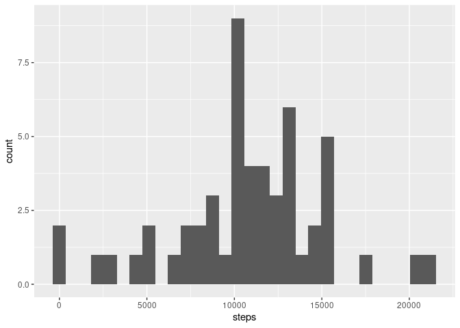
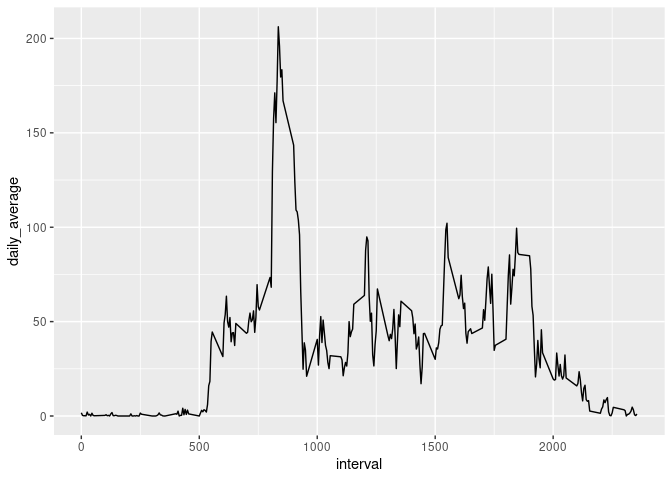
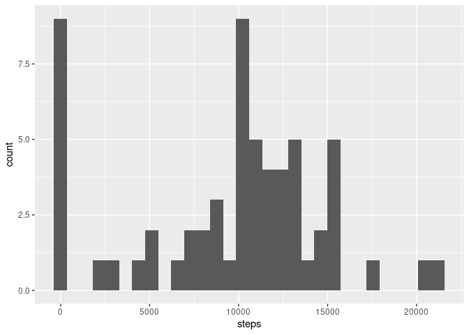
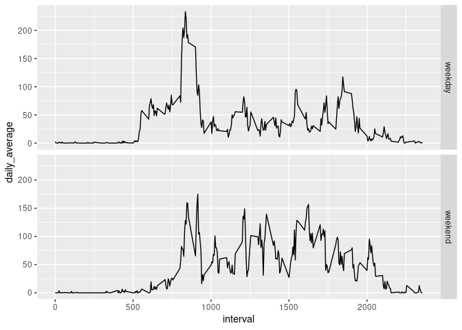

Data Preprocessing
------------------

First, we need to unzip and load the data into R. This next chuck of
code will be cached so that we will not be loading the data over and
over again.

    unzip(zipfile = "repdata_data_activity.zip")
    data <-read.csv(file = "activity.csv", header = TRUE, na.strings = "NA", colClasses = c("numeric", "Date", "numeric"))
    data$date <- as.Date(data$date, "%Y-%m-%d")
    head(data)

    ##   steps       date interval
    ## 1    NA 2012-10-01        0
    ## 2    NA 2012-10-01        5
    ## 3    NA 2012-10-01       10
    ## 4    NA 2012-10-01       15
    ## 5    NA 2012-10-01       20
    ## 6    NA 2012-10-01       25

    summary(data)

    ##      steps             date               interval     
    ##  Min.   :  0.00   Min.   :2012-10-01   Min.   :   0.0  
    ##  1st Qu.:  0.00   1st Qu.:2012-10-16   1st Qu.: 588.8  
    ##  Median :  0.00   Median :2012-10-31   Median :1177.5  
    ##  Mean   : 37.38   Mean   :2012-10-31   Mean   :1177.5  
    ##  3rd Qu.: 12.00   3rd Qu.:2012-11-15   3rd Qu.:1766.2  
    ##  Max.   :806.00   Max.   :2012-11-30   Max.   :2355.0  
    ##  NA's   :2304

What is mean total number of steps taken per day?
-------------------------------------------------

Now, we are going to make a histogram of the total number of steps taken
each day. To do this, we will be using the *ggplot2* package. Also, we
will group total steps by day, and consider only the complete cases.

    library(ggplot2)
    library(dplyr)
    data_histogram <- data[complete.cases(data),] %>% group_by(date)%>%
            summarise(steps= sum(steps, na.rm = TRUE))

    ggplot(data_histogram, aes(steps)) + 
            geom_histogram()

Now that we have the steps taken by day, we can easily compute the mean
and the median.

    mean(data_histogram$steps)

    ## [1] 10766.19

    median(data_histogram$steps)

    ## [1] 10765

What is the average daily activity pattern?
-------------------------------------------

We are going to make a time series plot of the 5-minute interval and the
average number of steps taken, averaged across all days . To do this, we
need to group the data by time interval, and compute the mean per
interval.

    data_timeSeries <- data %>% group_by(interval) %>%
            summarise(daily_average = mean(steps, na.rm = TRUE))

    ggplot(data_timeSeries, aes(interval, daily_average)) + geom_line()

Now, we can easily obtain the maximum average value and its respective
interval:

    data_timeSeries[which.max(data_timeSeries$daily_average),]

    ## # A tibble: 1 x 2
    ##   interval daily_average
    ##      <dbl>         <dbl>
    ## 1      835          206.

Imputing missing values
-----------------------

We need to check how many rows have missing values.

    sum(!complete.cases(data))

    ## [1] 2304

Now, we want to fill all those NA values. For this, we will use the
daily average for the respective time interval. We will check if a value
is missing and if it is, we will replace fill it.

    filled_data <- data
    for(i in 1:length(filled_data$steps))
          if(is.na(filled_data$steps[i]))
                filled_data$steps[i] <- data_timeSeries$daily_average[i]

With this done, we can remake the histogram we make before.

    data_histogram2 <- filled_data %>% group_by(date)%>%
            summarise(steps= sum(steps, na.rm = TRUE))

    ggplot(data_histogram2, aes(steps)) + 
            geom_histogram()

The new mean and median for this data set is:

    mean(data_histogram2$steps)

    ## [1] 9530.724

    median(data_histogram2$steps)

    ## [1] 10439

From this, we see that the mean and the median differ from the once we
computed before, being the newer onces smalles.

Are there differences in activity patterns between weekdays and weekends?
-------------------------------------------------------------------------

To find out if there are any differences in the activity between
weekends and weekdays, we will create a new data set with a new factor
variable with 2 levels: weekday and weekend.

    days <-c("lunes","martes","miércoles","jueves","viernes")
    week_activity <- filled_data
    week_activity$activity <- ifelse(weekdays(week_activity$date) %in% days , "weekday" ,"weekend")

At last, we want to make a plot comparing the weekday activity and the
weekend activity.

    data_timeSeries2 <- week_activity %>% group_by(activity, interval) %>%
            summarise(daily_average = mean(steps, na.rm = TRUE))

    ggplot(data_timeSeries2, aes(interval, daily_average)) + geom_line() + facet_grid(activity~.)

